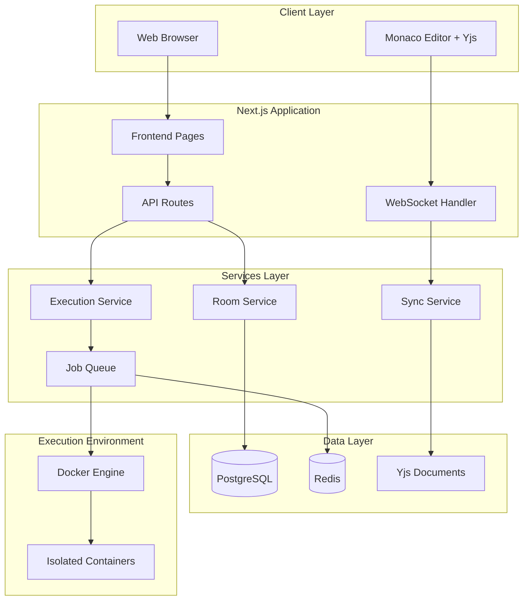

# Design Document

## Overview

The Collaborative Coding Room is a real-time collaborative code editing platform built with Next.js 15, featuring secure C++ code execution in isolated Docker containers. The architecture follows a microservices pattern with clear separation between the web frontend, real-time synchronization layer, and secure code execution backend.

### Key Technologies
- **Frontend**: Next.js 15 with App Router, TypeScript, TailwindCSS, shadcn/ui
- **Real-time Editor**: Monaco Editor with y-monaco bindings
- **Synchronization**: Yjs with WebSocket provider
- **Database**: PostgreSQL with Prisma ORM
- **Code Execution**: Docker containers with strict security policies
- **WebSockets**: Socket.io for real-time communication
- **Queue System**: Bull Queue with Redis for job processing

## Architecture

### High-Level Architecture



### Component Architecture

```mermaid
graph LR
    subgraph "Frontend Components"
        RC[RoomCreator]
        RJ[RoomJoiner]
        CE[CodeEditor]
        CP[CompilePanel]
        OP[OutputPanel]
        UP[UserPresence]
    end
    
    subgraph "Hooks & Context"
        YC[YjsContext]
        RC_CTX[RoomContext]
        WS_CTX[WebSocketContext]
    end
    
    subgraph "API Routes"
        ROOM_API[/api/rooms]
        COMPILE_API[/api/compile]
        WS_API[/api/socket]
    end
    
    CE --> YC
    CE --> RC_CTX
    CP --> COMPILE_API
    RC --> ROOM_API
    RJ --> ROOM_API
    UP --> WS_CTX
    WS_CTX --> WS_API
```

## Components and Interfaces

### Frontend Components

#### 1. Room Management Components

**RoomCreator Component**
```typescript
interface RoomCreatorProps {
  onRoomCreated: (roomKey: string) => void;
}

interface CreateRoomResponse {
  roomKey: string;
  roomId: string;
  createdAt: string;
}
```

**RoomJoiner Component**
```typescript
interface RoomJoinerProps {
  onRoomJoined: (roomData: RoomData) => void;
}

interface RoomData {
  roomId: string;
  roomKey: string;
  participants: Participant[];
  codeContent: string;
}
```

#### 2. Code Editor Components

**CodeEditor Component**
```typescript
interface CodeEditorProps {
  roomId: string;
  yjsProvider: WebsocketProvider;
  onCompileRequest: (code: string) => void;
}

interface EditorState {
  code: string;
  cursors: Map<string, CursorPosition>;
  selections: Map<string, Selection>;
}
```

**CompilePanel Component**
```typescript
interface CompilePanelProps {
  code: string;
  onCompile: (code: string, options: CompileOptions) => void;
  isCompiling: boolean;
}

interface CompileOptions {
  flags: string[];
  timeout: number;
  memoryLimit: string;
}
```

#### 3. Real-time Collaboration Components

**UserPresence Component**
```typescript
interface UserPresenceProps {
  participants: Participant[];
  currentUserId: string;
}

interface Participant {
  id: string;
  name: string;
  color: string;
  cursor?: CursorPosition;
  isActive: boolean;
}
```

### Backend Services

#### 1. Room Service

```typescript
interface RoomService {
  createRoom(): Promise<Room>;
  joinRoom(roomKey: string, userId: string): Promise<RoomData>;
  getRoomData(roomId: string): Promise<RoomData>;
  updateRoomSnapshot(roomId: string, content: string): Promise<void>;
  archiveInactiveRooms(): Promise<void>;
}

interface Room {
  id: string;
  key: string;
  createdAt: Date;
  lastActivity: Date;
  isArchived: boolean;
  participantCount: number;
}
```

#### 2. Execution Service

```typescript
interface ExecutionService {
  compileAndRun(code: string, options: ExecutionOptions): Promise<ExecutionResult>;
  queueJob(job: CompileJob): Promise<string>;
  getJobStatus(jobId: string): Promise<JobStatus>;
}

interface ExecutionOptions {
  timeout: number;
  memoryLimit: string;
  cpuLimit: string;
  compilerFlags: string[];
}

interface ExecutionResult {
  success: boolean;
  stdout: string;
  stderr: string;
  exitCode: number;
  executionTime: number;
  memoryUsed: number;
}

interface CompileJob {
  id: string;
  roomId: string;
  userId: string;
  code: string;
  options: ExecutionOptions;
  status: 'queued' | 'running' | 'completed' | 'failed';
  createdAt: Date;
}
```

#### 3. Synchronization Service

```typescript
interface SyncService {
  initializeYjsDocument(roomId: string): Promise<Y.Doc>;
  handleWebSocketConnection(socket: Socket, roomId: string): void;
  broadcastCursorUpdate(roomId: string, userId: string, cursor: CursorPosition): void;
  persistSnapshot(roomId: string, content: string): Promise<void>;
}
```

### API Interfaces

#### Room Management API

```typescript
// POST /api/rooms
interface CreateRoomRequest {
  // No body required
}

interface CreateRoomResponse {
  roomKey: string;
  roomId: string;
  createdAt: string;
}

// POST /api/rooms/join
interface JoinRoomRequest {
  roomKey: string;
  userId?: string;
}

interface JoinRoomResponse {
  roomData: RoomData;
  yjsDocumentState: Uint8Array;
}
```

#### Compilation API

```typescript
// POST /api/compile
interface CompileRequest {
  roomId: string;
  code: string;
  options?: CompileOptions;
}

interface CompileResponse {
  jobId: string;
  status: 'queued';
}

// GET /api/compile/[jobId]
interface CompileStatusResponse {
  jobId: string;
  status: JobStatus;
  result?: ExecutionResult;
}
```

## Data Models

### Database Schema

#### Rooms Table
```sql
CREATE TABLE rooms (
  id UUID PRIMARY KEY DEFAULT gen_random_uuid(),
  key VARCHAR(12) UNIQUE NOT NULL,
  created_at TIMESTAMP WITH TIME ZONE DEFAULT NOW(),
  last_activity TIMESTAMP WITH TIME ZONE DEFAULT NOW(),
  is_archived BOOLEAN DEFAULT FALSE,
  participant_count INTEGER DEFAULT 0,
  code_snapshot TEXT,
  yjs_state BYTEA
);

CREATE INDEX idx_rooms_key ON rooms(key);
CREATE INDEX idx_rooms_last_activity ON rooms(last_activity);
```

#### Participants Table
```sql
CREATE TABLE participants (
  id UUID PRIMARY KEY DEFAULT gen_random_uuid(),
  room_id UUID REFERENCES rooms(id) ON DELETE CASCADE,
  user_id VARCHAR(255) NOT NULL,
  joined_at TIMESTAMP WITH TIME ZONE DEFAULT NOW(),
  last_seen TIMESTAMP WITH TIME ZONE DEFAULT NOW(),
  is_active BOOLEAN DEFAULT TRUE,
  cursor_position JSONB,
  user_color VARCHAR(7)
);

CREATE INDEX idx_participants_room_id ON participants(room_id);
CREATE INDEX idx_participants_user_id ON participants(user_id);
```

#### Compile Jobs Table
```sql
CREATE TABLE compile_jobs (
  id UUID PRIMARY KEY DEFAULT gen_random_uuid(),
  room_id UUID REFERENCES rooms(id) ON DELETE CASCADE,
  user_id VARCHAR(255) NOT NULL,
  code TEXT NOT NULL,
  options JSONB NOT NULL,
  status VARCHAR(20) DEFAULT 'queued',
  created_at TIMESTAMP WITH TIME ZONE DEFAULT NOW(),
  started_at TIMESTAMP WITH TIME ZONE,
  completed_at TIMESTAMP WITH TIME ZONE,
  stdout TEXT,
  stderr TEXT,
  exit_code INTEGER,
  execution_time INTEGER,
  memory_used INTEGER
);

CREATE INDEX idx_compile_jobs_room_id ON compile_jobs(room_id);
CREATE INDEX idx_compile_jobs_status ON compile_jobs(status);
CREATE INDEX idx_compile_jobs_created_at ON compile_jobs(created_at);
```

#### Room Snapshots Table
```sql
CREATE TABLE room_snapshots (
  id UUID PRIMARY KEY DEFAULT gen_random_uuid(),
  room_id UUID REFERENCES rooms(id) ON DELETE CASCADE,
  content TEXT NOT NULL,
  yjs_state BYTEA,
  created_at TIMESTAMP WITH TIME ZONE DEFAULT NOW(),
  snapshot_type VARCHAR(20) DEFAULT 'auto'
);

CREATE INDEX idx_room_snapshots_room_id ON room_snapshots(room_id);
CREATE INDEX idx_room_snapshots_created_at ON room_snapshots(created_at);
```

### Prisma Schema

```prisma
model Room {
  id              String    @id @default(dbgenerated("gen_random_uuid()")) @db.Uuid
  key             String    @unique @db.VarChar(12)
  createdAt       DateTime  @default(now()) @map("created_at") @db.Timestamptz
  lastActivity    DateTime  @default(now()) @map("last_activity") @db.Timestamptz
  isArchived      Boolean   @default(false) @map("is_archived")
  participantCount Int      @default(0) @map("participant_count")
  codeSnapshot    String?   @map("code_snapshot") @db.Text
  yjsState        Bytes?    @map("yjs_state")
  
  participants    Participant[]
  compileJobs     CompileJob[]
  snapshots       RoomSnapshot[]
  
  @@index([key])
  @@index([lastActivity])
  @@map("rooms")
}

model Participant {
  id             String    @id @default(dbgenerated("gen_random_uuid()")) @db.Uuid
  roomId         String    @map("room_id") @db.Uuid
  userId         String    @map("user_id") @db.VarChar(255)
  joinedAt       DateTime  @default(now()) @map("joined_at") @db.Timestamptz
  lastSeen       DateTime  @default(now()) @map("last_seen") @db.Timestamptz
  isActive       Boolean   @default(true) @map("is_active")
  cursorPosition Json?     @map("cursor_position")
  userColor      String?   @map("user_color") @db.VarChar(7)
  
  room           Room      @relation(fields: [roomId], references: [id], onDelete: Cascade)
  
  @@index([roomId])
  @@index([userId])
  @@map("participants")
}

model CompileJob {
  id            String    @id @default(dbgenerated("gen_random_uuid()")) @db.Uuid
  roomId        String    @map("room_id") @db.Uuid
  userId        String    @map("user_id") @db.VarChar(255)
  code          String    @db.Text
  options       Json
  status        String    @default("queued") @db.VarChar(20)
  createdAt     DateTime  @default(now()) @map("created_at") @db.Timestamptz
  startedAt     DateTime? @map("started_at") @db.Timestamptz
  completedAt   DateTime? @map("completed_at") @db.Timestamptz
  stdout        String?   @db.Text
  stderr        String?   @db.Text
  exitCode      Int?      @map("exit_code")
  executionTime Int?      @map("execution_time")
  memoryUsed    Int?      @map("memory_used")
  
  room          Room      @relation(fields: [roomId], references: [id], onDelete: Cascade)
  
  @@index([roomId])
  @@index([status])
  @@index([createdAt])
  @@map("compile_jobs")
}

model RoomSnapshot {
  id           String   @id @default(dbgenerated("gen_random_uuid()")) @db.Uuid
  roomId       String   @map("room_id") @db.Uuid
  content      String   @db.Text
  yjsState     Bytes?   @map("yjs_state")
  createdAt    DateTime @default(now()) @map("created_at") @db.Timestamptz
  snapshotType String   @default("auto") @map("snapshot_type") @db.VarChar(20)
  
  room         Room     @relation(fields: [roomId], references: [id], onDelete: Cascade)
  
  @@index([roomId])
  @@index([createdAt])
  @@map("room_snapshots")
}
```

## Error Handling

### Error Types and Handling Strategy

#### 1. Client-Side Error Handling

```typescript
enum ErrorType {
  NETWORK_ERROR = 'NETWORK_ERROR',
  ROOM_NOT_FOUND = 'ROOM_NOT_FOUND',
  COMPILATION_ERROR = 'COMPILATION_ERROR',
  WEBSOCKET_ERROR = 'WEBSOCKET_ERROR',
  VALIDATION_ERROR = 'VALIDATION_ERROR'
}

interface AppError {
  type: ErrorType;
  message: string;
  details?: any;
  timestamp: Date;
}

class ErrorHandler {
  static handle(error: AppError): void {
    // Log error
    console.error(`[${error.type}] ${error.message}`, error.details);
    
    // Show user-friendly message
    toast.error(this.getUserMessage(error));
    
    // Report to monitoring service
    this.reportError(error);
  }
  
  private static getUserMessage(error: AppError): string {
    switch (error.type) {
      case ErrorType.ROOM_NOT_FOUND:
        return 'Room not found. Please check the room key.';
      case ErrorType.COMPILATION_ERROR:
        return 'Code compilation failed. Check the output panel for details.';
      case ErrorType.WEBSOCKET_ERROR:
        return 'Connection lost. Attempting to reconnect...';
      default:
        return 'An unexpected error occurred. Please try again.';
    }
  }
}
```

#### 2. API Error Handling

```typescript
interface APIError {
  code: string;
  message: string;
  details?: any;
  statusCode: number;
}

class APIErrorHandler {
  static createError(code: string, message: string, statusCode: number = 500): APIError {
    return { code, message, statusCode };
  }
  
  static handleError(error: any): Response {
    if (error instanceof APIError) {
      return Response.json(error, { status: error.statusCode });
    }
    
    // Log unexpected errors
    console.error('Unexpected API error:', error);
    
    return Response.json(
      { code: 'INTERNAL_ERROR', message: 'Internal server error' },
      { status: 500 }
    );
  }
}
```

#### 3. Docker Execution Error Handling

```typescript
interface ExecutionError {
  type: 'TIMEOUT' | 'MEMORY_LIMIT' | 'COMPILATION_ERROR' | 'RUNTIME_ERROR' | 'SYSTEM_ERROR';
  message: string;
  exitCode?: number;
  signal?: string;
}

class ExecutionErrorHandler {
  static handleDockerError(error: any): ExecutionError {
    if (error.signal === 'SIGKILL') {
      return {
        type: 'TIMEOUT',
        message: 'Code execution timed out',
        signal: error.signal
      };
    }
    
    if (error.message?.includes('memory')) {
      return {
        type: 'MEMORY_LIMIT',
        message: 'Code execution exceeded memory limit'
      };
    }
    
    return {
      type: 'SYSTEM_ERROR',
      message: 'System error during code execution',
      exitCode: error.exitCode
    };
  }
}
```

## Testing Strategy

### 1. Unit Testing

**Frontend Components**
- Test React components with React Testing Library
- Mock WebSocket connections and Yjs providers
- Test user interactions and state management

**Backend Services**
- Test API routes with Jest and Supertest
- Mock database operations with Prisma mock
- Test Docker execution with containerized test environment

### 2. Integration Testing

**Real-time Collaboration**
- Test Yjs synchronization between multiple clients
- Verify WebSocket message handling
- Test conflict resolution scenarios

**Code Execution Pipeline**
- Test end-to-end compilation and execution flow
- Verify security constraints are enforced
- Test job queue processing and error handling

### 3. Security Testing

**Container Security**
- Verify container isolation and resource limits
- Test escape attempt scenarios
- Validate network isolation

**Input Validation**
- Test SQL injection prevention
- Verify XSS protection
- Test path traversal prevention

### 4. Performance Testing

**Load Testing**
- Test concurrent user limits
- Measure WebSocket connection scalability
- Test Docker container creation/destruction performance

**Stress Testing**
- Test memory-intensive code execution
- Verify CPU limit enforcement
- Test database performance under load

### Test Configuration

```typescript
// jest.config.js
module.exports = {
  testEnvironment: 'jsdom',
  setupFilesAfterEnv: ['<rootDir>/jest.setup.js'],
  moduleNameMapping: {
    '^@/(.*)$': '<rootDir>/$1',
  },
  testMatch: [
    '**/__tests__/**/*.(ts|tsx)',
    '**/*.(test|spec).(ts|tsx)'
  ],
  collectCoverageFrom: [
    'app/**/*.(ts|tsx)',
    'lib/**/*.(ts|tsx)',
    '!**/*.d.ts',
    '!**/node_modules/**'
  ]
};
```

This design provides a comprehensive, production-ready architecture for the Collaborative Coding Room application with proper separation of concerns, security hardening, and scalability considerations.